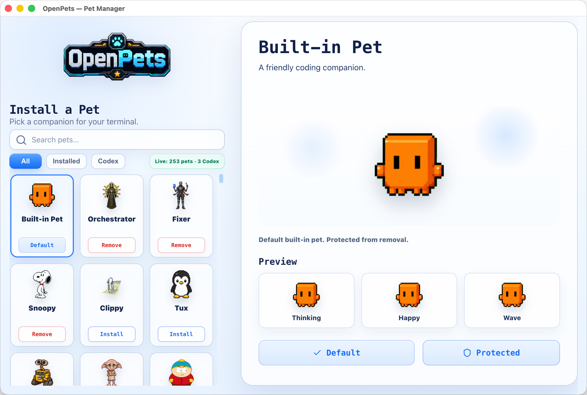
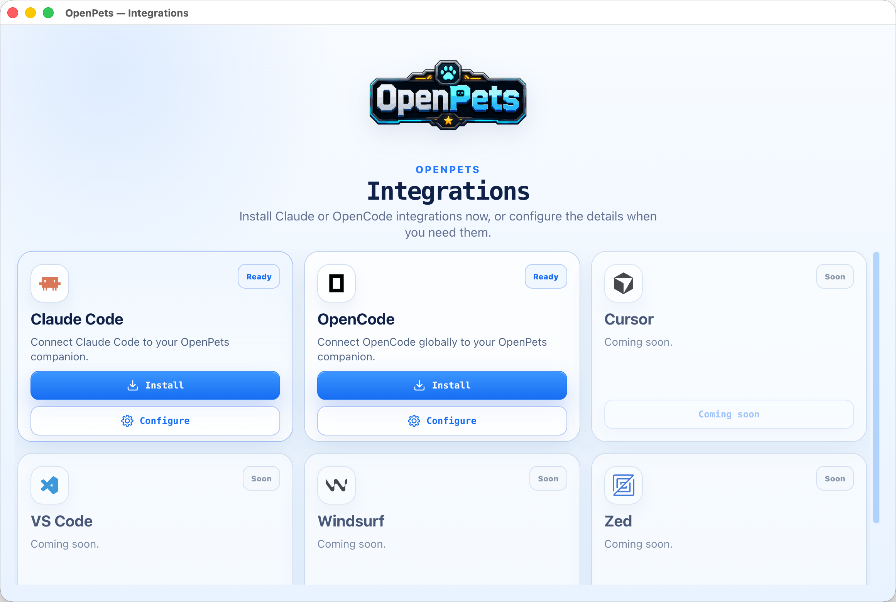
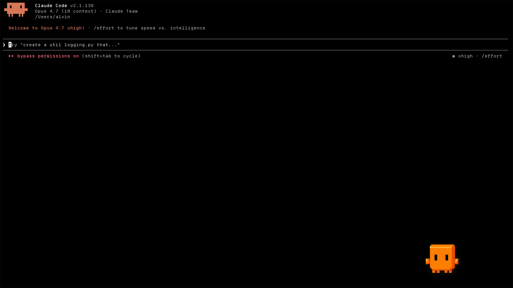

<p align="center">
  
</p>

<p align="center">
  <strong>Your crew. Always watching. Always reacting.</strong>
</p>

<p align="center">
  Noel Crew is a tray-first desktop companion app for AI coding agents.<br/>
  Watch your agent think, edit, test, and ship — through the eyes of a tiny animated companion.
</p>

---

## What is Noel Crew?

Noel Crew puts a live desktop pet on your screen that reacts to everything your coding agent does — thinking, editing, running tests, waiting for your approval, finishing, or hitting an error.

- **Desktop companion** — a small animated pet that reacts in real time to agent activity.
- **Agent integrations** — first-class setup for Claude Code and OpenCode, including MCP tools, instructions, and automatic hooks/plugins.
- **MCP ready** — any MCP-capable agent can send speech bubbles and reactions through the Noel Crew MCP server.
- **Pet-pack friendly** — load installed animated pet packs and route each agent/project to its own pet window.
- **Privacy-conscious by design** — automatic hook speech is static and local; prompts, code, logs, command output, URLs, paths, and secrets are never shown in bubbles.

## Manage your crew

Browse installed pets, preview their animations, and choose which companion follows each coding agent.

<p align="center">
  
</p>

## Quick start

### 1. Install Noel Crew Desktop

Download the latest installer from [Noel Crew Releases](https://github.com/noelclaw/noel-crew/releases/latest):

- **macOS Apple Silicon**: `NoelCrew-*-mac-arm64.dmg`
- **macOS Intel**: `NoelCrew-*-mac-x64.dmg`
- **Windows**: `NoelCrew-*-win-x64-setup.exe`
- **Linux**: `NoelCrew-*-linux-x86_64.AppImage`

Launch Noel Crew. You'll see the desktop pet and the Noel Crew tray/menu-bar icon.

> Current builds may be unsigned. macOS or Windows may show a security warning the first time.

If macOS says the app is damaged, remove the quarantine flag:

```bash
xattr -dr com.apple.quarantine /Applications/Noel\ Crew.app
open /Applications/Noel\ Crew.app
```

### 2. Connect your agent

Use the desktop **Integrations** screen for global setup:

- **Claude Code** — installs Noel Crew MCP, Claude memory instructions, and optional hooks.
- **OpenCode** — installs Noel Crew MCP, an instruction file, and the `@noelclaw/opencode` plugin.

<p align="center">
  
</p>

For project-local setup, run the CLI from your project directory:

```bash
npx -y @noelclaw/cli configure --agent claude --pet <petId>
npx -y @noelclaw/cli configure --agent opencode --pet <petId>
```

## Agent integrations

Noel Crew integrations have three layers:

1. **MCP tools** for explicit agent actions.
2. **Agent instructions** so agents know when to use those tools.
3. **Hooks/plugins** for automatic reactions during normal agent work.

### Claude Code

<p align="center">
  
</p>

Claude Code integration includes:

- `noelcrew` MCP setup via Claude Code.
- Managed Claude memory instructions in `~/.claude/CLAUDE.md` and `~/.claude/noelcrew.md`.
- Managed Claude hooks in `~/.claude/settings.json`.
- Project-local setup via `noelcrew configure --agent claude --pet <petId>`.

Global MCP setup:

```bash
claude mcp add --scope user noelcrew -- npx -y @noelclaw/mcp
```

With a specific pet:

```bash
claude mcp add --scope user noelcrew -- npx -y @noelclaw/mcp --pet <petId>
```

### OpenCode

OpenCode integration includes:

- MCP entry using `@noelclaw/cli mcp`.
- A managed `noelcrew.md` instruction file.
- The `@noelclaw/opencode` plugin for automatic reactions.

Project-local setup:

```bash
npx -y @noelclaw/cli configure --agent opencode --pet <petId>
```

### Generic MCP clients

Any MCP-capable agent can connect while the desktop app is running:

```json
{
  "mcpServers": {
    "noelcrew": {
      "type": "stdio",
      "command": "npx",
      "args": ["-y", "@noelclaw/mcp"]
    }
  }
}
```

To target a specific pet:

```json
{
  "mcpServers": {
    "noelcrew": {
      "type": "stdio",
      "command": "npx",
      "args": ["-y", "@noelclaw/mcp", "--pet", "<petId>"]
    }
  }
}
```

Available MCP tools:

- `noelcrew_status` — check whether Noel Crew is reachable and which pet is targeted.
- `noelcrew_react` — set a short reaction on the target pet.
- `noelcrew_say` — show a short safe speech bubble, optionally with a reaction.

`noelcrew_say` messages must be short, single-line, and must not look like code, logs, secrets, URLs, or file paths.

## Reactions

Common reaction mapping:

| Agent activity | Reaction |
| --- | --- |
| Prompt/chat starts | `thinking` |
| File edit/write/patch | `editing` |
| Test-like shell command | `testing` |
| Permission request | `waiting` |
| Successful idle/stop | `success` |
| Session/error stop | `error` |

Automatic hook speech is throttled and drawn from local static message pools like `Approval needed` or `Something failed`.

## How it works

```text
Claude Code / OpenCode / MCP client
  -> @noelclaw/mcp, @noelclaw/cli mcp, @noelclaw/claude hook, @noelclaw/opencode plugin
  -> @noelclaw/client
  -> Noel Crew desktop local IPC discovery file
  -> Noel Crew desktop IPC socket/pipe
  -> default pet or selected agent pet window
```

## Development

### Requirements

- Node.js 20+
- pnpm 11+
- TypeScript

### Install

```bash
pnpm install
```

### Run the desktop app

```bash
pnpm dev:desktop
```

### Build

```bash
pnpm build
```

### Package desktop builds

```bash
pnpm package:desktop
```

## Workspace layout

```text
apps/desktop              Electron desktop app
packages/client           @noelclaw/client, local IPC client
packages/mcp              @noelclaw/mcp, MCP stdio server
packages/claude           @noelclaw/claude, Claude hook helpers
packages/opencode         @noelclaw/opencode, OpenCode plugin
packages/pi               @noelclaw/pi, Pi extension
packages/agent-events     Shared safe agent event speech helpers
packages/cli              @noelclaw/cli, CLI and MCP/hook entrypoints
packages/pet-format       @noelclaw/pet-format, pet/catalog format types
docs/                     Documentation
```

## Safety and privacy

- Noel Crew local IPC is local-only and protected by a per-run token.
- Hook/plugin errors are swallowed unless debug logging is enabled.
- Automatic speech is static and local; it does not include model-generated prompt text.
- Tool inputs and command text are used only for coarse reaction classification.
- Managed setup preserves unrelated user config and removes only Noel Crew-managed entries.
- Speech validation rejects code-like, secret-like, URL-like, path-like, or multiline messages.

## Links

- **Homepage**: [noelclaw.fun](https://noelclaw.fun)
- **Releases**: [github.com/noelclaw/noel-crew/releases](https://github.com/noelclaw/noel-crew/releases)
- **Repository**: [github.com/noelclaw/noel-crew](https://github.com/noelclaw/noel-crew)
